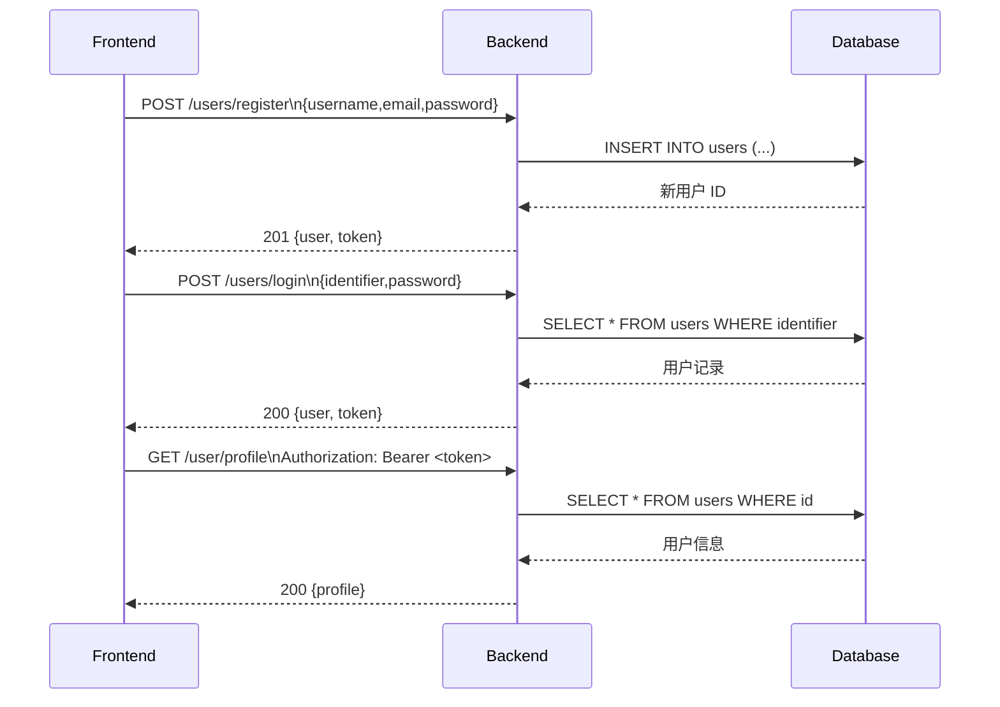
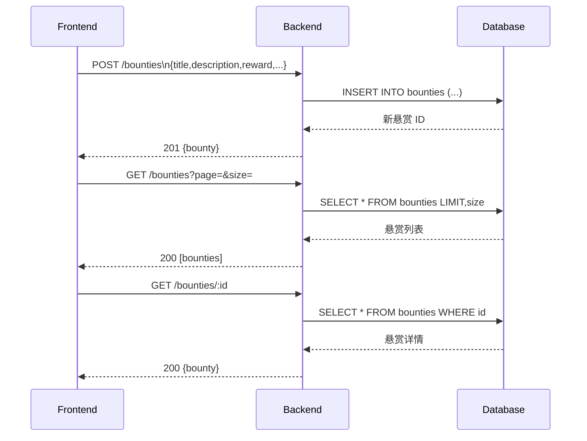
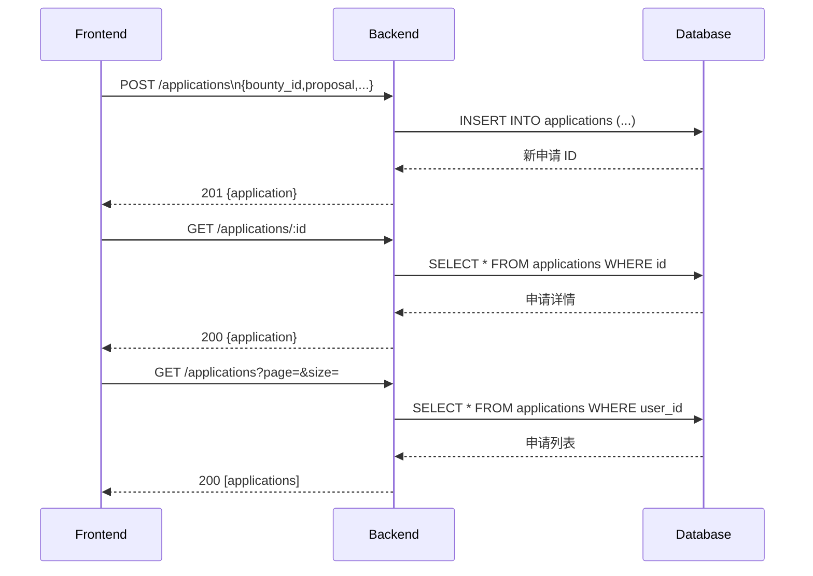
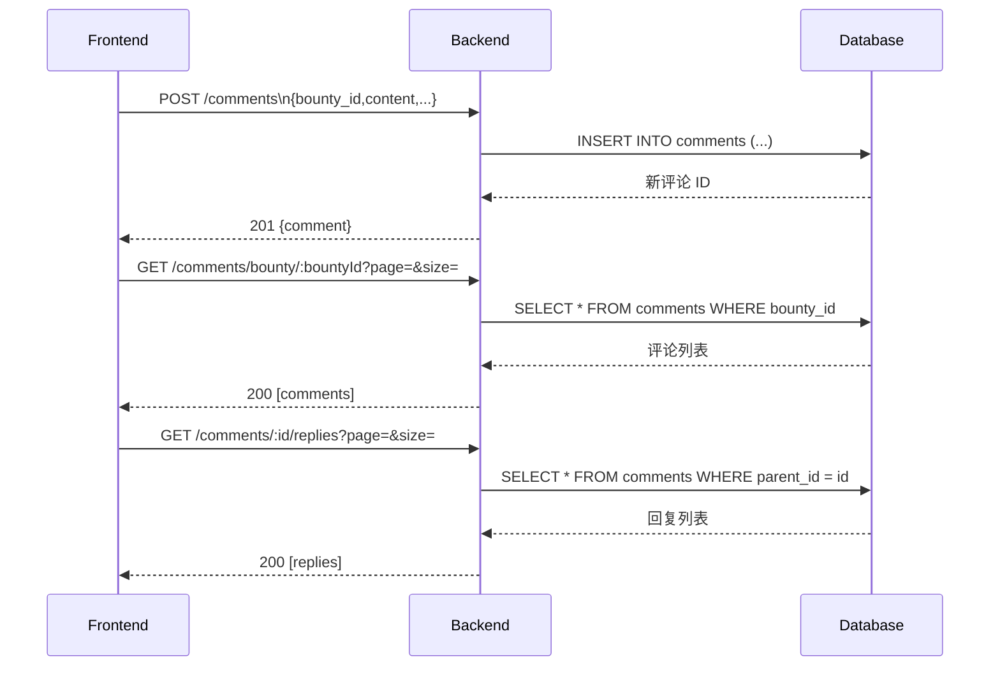
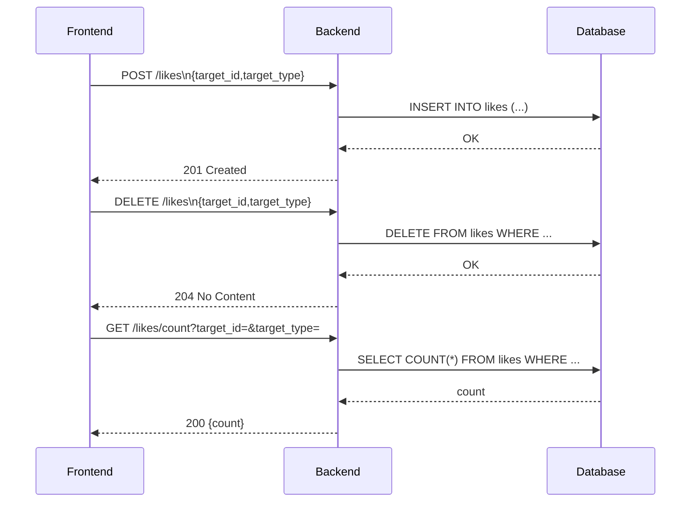
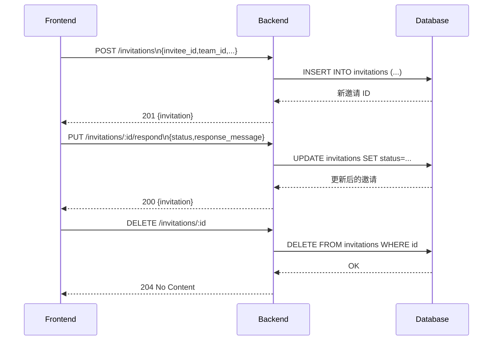
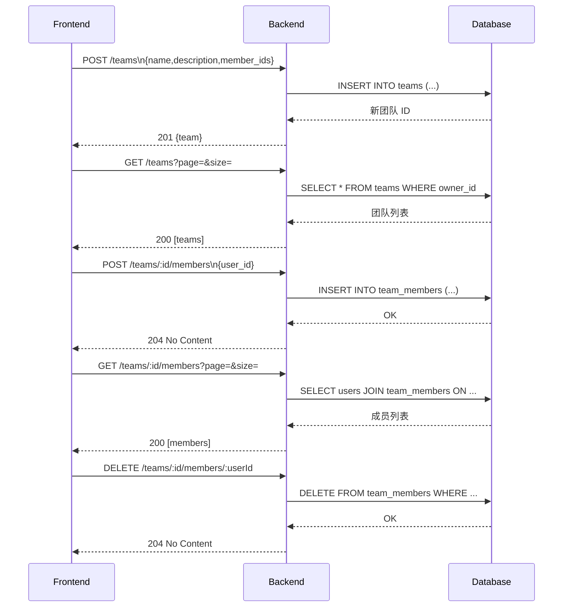
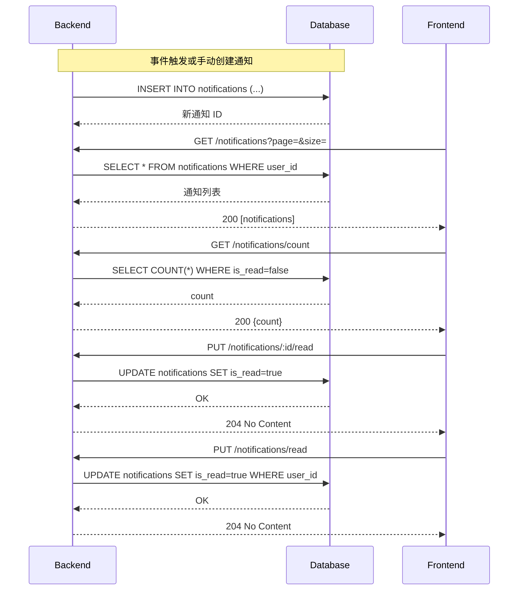

# OnePenny 接口流程图

## 1. 用户认证流程

```mermaid
sequenceDiagram
  participant UI as Frontend
  participant API as Backend
  participant DB as Database

  UI->>API: POST /users/register\n{username,email,password}
  API->>DB: INSERT INTO users (...)
  DB-->>API: 新用户 ID
  API-->>UI: 201 {user, token}

  UI->>API: POST /users/login\n{identifier,password}
  API->>DB: SELECT * FROM users WHERE identifier
  DB-->>API: 用户记录
  API-->>UI: 200 {user, token}

  UI->>API: GET /user/profile\nAuthorization: Bearer <token>
  API->>DB: SELECT * FROM users WHERE id
  DB-->>API: 用户信息
  API-->>UI: 200 {profile}
```

## 2. 悬赏令创建与查看流程

```mermaid
sequenceDiagram
  participant UI as Frontend
  participant API as Backend
  participant DB as Database

  UI->>API: POST /bounties\n{title,description,reward,...}
  API->>DB: INSERT INTO bounties (...)
  DB-->>API: 新悬赏 ID
  API-->>UI: 201 {bounty}

  UI->>API: GET /bounties?page=&size=
  API->>DB: SELECT * FROM bounties LIMIT,size
  DB-->>API: 悬赏列表
  API-->>UI: 200 [bounties]

  UI->>API: GET /bounties/:id
  API->>DB: SELECT * FROM bounties WHERE id
  DB-->>API: 悬赏详情
  API-->>UI: 200 {bounty}

```

## 3. 悬赏申请流程

```mermaid
sequenceDiagram
  participant UI as Frontend
  participant API as Backend
  participant DB as Database

  UI->>API: POST /applications\n{bounty_id,proposal,...}
  API->>DB: INSERT INTO applications (...)
  DB-->>API: 新申请 ID
  API-->>UI: 201 {application}

  UI->>API: GET /applications/:id
  API->>DB: SELECT * FROM applications WHERE id
  DB-->>API: 申请详情
  API-->>UI: 200 {application}

  UI->>API: GET /applications?page=&size=
  API->>DB: SELECT * FROM applications WHERE user_id
  DB-->>API: 申请列表
  API-->>UI: 200 [applications]

```

## 4. 评论流程

```mermaid
sequenceDiagram
  participant UI as Frontend
  participant API as Backend
  participant DB as Database

  UI->>API: POST /comments\n{bounty_id,content,...}
  API->>DB: INSERT INTO comments (...)
  DB-->>API: 新评论 ID
  API-->>UI: 201 {comment}

  UI->>API: GET /comments/bounty/:bountyId?page=&size=
  API->>DB: SELECT * FROM comments WHERE bounty_id
  DB-->>API: 评论列表
  API-->>UI: 200 [comments]

  UI->>API: GET /comments/:id/replies?page=&size=
  API->>DB: SELECT * FROM comments WHERE parent_id = id
  DB-->>API: 回复列表
  API-->>UI: 200 [replies]

```

## 5. 点赞流程

```mermaid
sequenceDiagram
  participant UI as Frontend
  participant API as Backend
  participant DB as Database

  UI->>API: POST /likes\n{target_id,target_type}
  API->>DB: INSERT INTO likes (...)
  DB-->>API: OK
  API-->>UI: 201 Created

  UI->>API: DELETE /likes\n{target_id,target_type}
  API->>DB: DELETE FROM likes WHERE ...
  DB-->>API: OK
  API-->>UI: 204 No Content

  UI->>API: GET /likes/count?target_id=&target_type=
  API->>DB: SELECT COUNT(*) FROM likes WHERE ...
  DB-->>API: count
  API-->>UI: 200 {count}

```

## 6. 组队邀请流程

```mermaid
sequenceDiagram
  participant UI as Frontend
  participant API as Backend
  participant DB as Database

  UI->>API: POST /invitations\n{invitee_id,team_id,...}
  API->>DB: INSERT INTO invitations (...)
  DB-->>API: 新邀请 ID
  API-->>UI: 201 {invitation}

  UI->>API: PUT /invitations/:id/respond\n{status,response_message}
  API->>DB: UPDATE invitations SET status=...
  DB-->>API: 更新后的邀请
  API-->>UI: 200 {invitation}

  UI->>API: DELETE /invitations/:id
  API->>DB: DELETE FROM invitations WHERE id
  DB-->>API: OK
  API-->>UI: 204 No Content

```

## 7. 团队管理流程

```mermaid
sequenceDiagram
  participant UI as Frontend
  participant API as Backend
  participant DB as Database

  UI->>API: POST /teams\n{name,description,member_ids}
  API->>DB: INSERT INTO teams (...)
  DB-->>API: 新团队 ID
  API-->>UI: 201 {team}

  UI->>API: GET /teams?page=&size=
  API->>DB: SELECT * FROM teams WHERE owner_id
  DB-->>API: 团队列表
  API-->>UI: 200 [teams]

  UI->>API: POST /teams/:id/members\n{user_id}
  API->>DB: INSERT INTO team_members (...)
  DB-->>API: OK
  API-->>UI: 204 No Content

  UI->>API: GET /teams/:id/members?page=&size=
  API->>DB: SELECT users JOIN team_members ON ...
  DB-->>API: 成员列表
  API-->>UI: 200 [members]

  UI->>API: DELETE /teams/:id/members/:userId
  API->>DB: DELETE FROM team_members WHERE ...
  DB-->>API: OK
  API-->>UI: 204 No Content

```

## 8. 通知流程

```mermaid
sequenceDiagram
  participant API as Backend
  participant DB as Database
  participant UI as Frontend

  Note over API,DB: 事件触发或手动创建通知
  API->>DB: INSERT INTO notifications (...)
  DB-->>API: 新通知 ID

  UI->>API: GET /notifications?page=&size=
  API->>DB: SELECT * FROM notifications WHERE user_id
  DB-->>API: 通知列表
  API-->>UI: 200 [notifications]

  UI->>API: GET /notifications/count
  API->>DB: SELECT COUNT(*) WHERE is_read=false
  DB-->>API: count
  API-->>UI: 200 {count}

  UI->>API: PUT /notifications/:id/read
  API->>DB: UPDATE notifications SET is_read=true
  DB-->>API: OK
  API-->>UI: 204 No Content

  UI->>API: PUT /notifications/read
  API->>DB: UPDATE notifications SET is_read=true WHERE user_id
  DB-->>API: OK
  API-->>UI: 204 No Content
```

